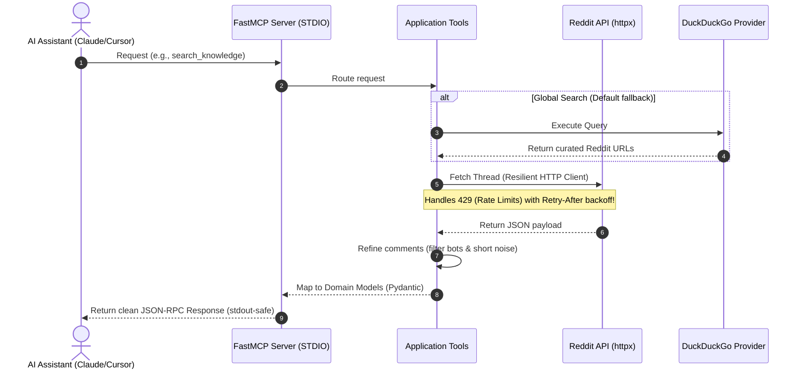

# 🤖 Reddit MCP Server (AI-Native Edition)

[](https://github.com/ismailsaoulaj/reddit-mcp-server/actions)
[](https://www.python.org/)
[](https://opensource.org/licenses/MIT)

A highly resilient, open-source [Model Context Protocol (MCP)](https://modelcontextprotocol.io/) server. It empowers AI models (such as Claude and Cursor) to search, fetch, read, and deep-dive into Reddit content with robust rate-limiting recovery and smart comment-filtering.

Built in Python using `FastMCP`, this project adheres to a strict **4-Layer Architecture** designed for high modularity, testability, and painless contributions.

---

## 🗺️ How it Works (Data Flow Sequence)

Here is a visual sequence diagram of how the AI model interacts with this server to retrieve Reddit insights:



---

## ✨ Features

- 🛡️ **Fail-Fast Configuration:** Utilizes `pydantic-settings` to validate credentials at boot, preventing runtime failures.
- 📈 **Resilient HTTP Client:** Built-in exponential backoff and rate-limiting recovery. If Reddit says `429 Too Many Requests`, the server respects the `Retry-After` header and retries automatically.
- 🔍 **Strategic Search:** Integrates a decoupled search provider system (Strategy Pattern) allowing easy addition of Google/Tavily search engines.
- 🤖 **LLM-Safe Filtering:** Cleans thread payloads by dropping auto-moderators, bot notifications, and low-quality comments, saving precious LLM token costs.
- ⏱️ **Strict LLM Timeout Protection:** Uses decorators to force safe API timeouts, returning clean graceful JSON-RPC fallbacks instead of hanging.

---

## ⚙️ Prerequisites & Setup

### Requirements

- Python 3.11 or higher
- Reddit API App credentials (Client ID and Client Secret)

### Quick Start (Local Installation)

1. **Clone and Install:**

```bash
git clone https://github.com/ismailsaoulaj/reddit-mcp-server.git
cd reddit-mcp-server
pip install -e .
```

2. **Configure your environment:**

Create a `.env` file in the root directory:

```env
REDDIT_CLIENT_ID="your_client_id_here"
REDDIT_CLIENT_SECRET="your_client_secret_here"
```

---

## 🐳 Docker Installation

A multi-stage Dockerfile is provided for seamless execution.

```bash
docker build -t reddit-mcp-server .
```

> **Note:** If using Docker, replace the `command` in client configs with `docker` and arguments with `run -i --rm reddit-mcp-server`.

---

## 🛠️ Configuration for AI Clients

### 1. Claude Desktop

Edit your configuration file:
- **macOS:** `~/Library/Application Support/Claude/claude_desktop_config.json`
- **Windows:** `%APPDATA%\Claude\claude_desktop_config.json`

```json
{
  "mcpServers": {
    "reddit": {
      "command": "hatch",
      "args": [
        "run",
        "reddit-mcp"
      ],
      "cwd": "/absolute/path/to/reddit-mcp-server"
    }
  }
}
```

### 2. Cursor

Go to **Settings > Features > MCP** and add a new command-based server:
- **Type:** command
- **Name:** Reddit
- **Command:** `hatch run reddit-mcp` (using the absolute path to your python/hatch environment)

---

## 🧪 Developer Experience (DX) & Testing

We prioritize high test coverage. We mock all network traffic, ensuring tests run instantly and reliably.

### Run Tests

```bash
# Install development dependencies
pip install -e ".[dev]"

# Execute pytest
pytest tests/
```

### Manual Testing with the MCP Inspector

```bash
npx @modelcontextprotocol/inspector hatch run reddit-mcp
```

This will launch a web browser UI where you can invoke the `search_reddit`, `get_subreddit_trends`, and `extract_post_threads` tools directly and inspect the JSON responses.

---

## 🤝 Contributing & Architecture

We love contributions! Please check out `docs/architecture.md` for architectural details and view `src/reddit_mcp/infrastructure/search/providers/README.md` to learn how to add a new search provider in seconds.

Please make sure your PR passes all linter checks (`ruff check .`) and unit tests (`pytest tests/`) before submitting.