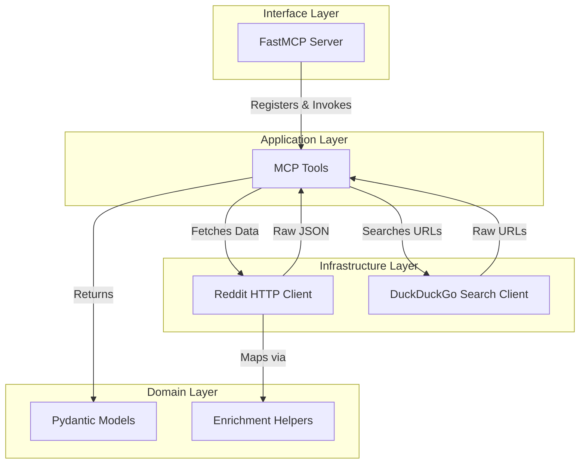

# Reddit MCP Server Architecture

This project is built using a strict 4-Layer Architecture to separate concerns, ensure testability, and provide a professional codebase structure.

## Layer Overview

1. **Domain Layer (`domain/`)**: The core of the application. Contains the Pydantic models representing the business entities (e.g., `RedditPost`, `RedditComment`, `RedditThread`), as well as pure enrichment/mapping helpers shared by the upper layers. This layer has no dependencies on other layers.
2. **Infrastructure Layer (`infrastructure/`)**: Handles communication with the outside world. This includes the asynchronous HTTP clients for Reddit (`RedditClient`) and DuckDuckGo (`DuckDuckGoSearchClient`), as well as logging setup.
3. **Application Layer (`application/`)**: Contains the business logic and the actual MCP tools (`tools.py`). It orchestrates data flow by calling the infrastructure clients and mapping the raw data to Domain models.
4. **Interface Layer (`interface/`)**: The entry point for the application. Contains the FastMCP server setup (`server.py`) which registers the application tools and exposes them via the Standard IO transport.

## Data Flow Diagram

## Benefits of this Architecture
- **Testability**: We can easily mock the `Infrastructure Layer` to test the `Application Layer` without making real network requests.
- **Maintainability**: If Reddit changes its API, we only need to update the `Infrastructure Layer` and mapping functions, leaving the `Domain` and `Interface` untouched.
- **Scalability**: New tools or alternative data sources can be seamlessly integrated.
